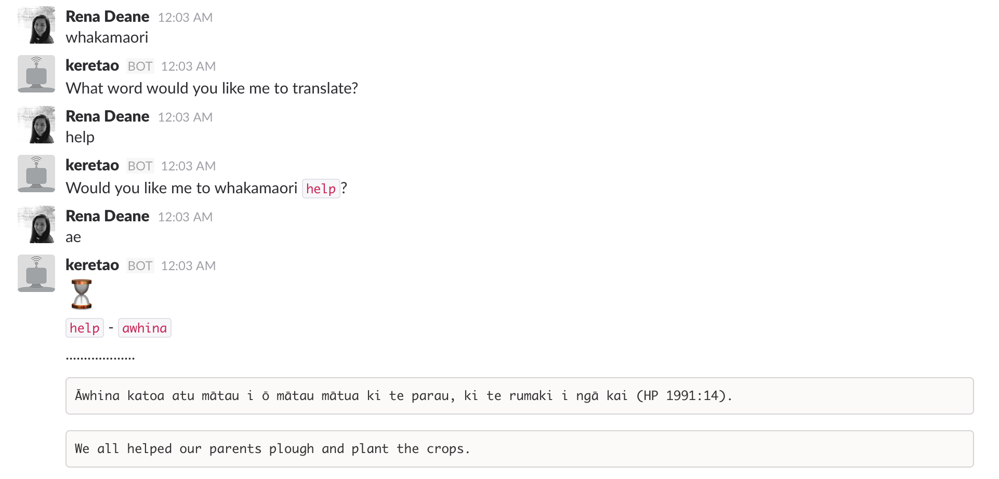

# Slackbro

- A slackbot that takes an english word and translates it in to Māori.
- Based on [Botkit](http://howdy.ai/botkit) - Building Blocks for Building Bots.

##Keretao (Maori word for Robot)
Direct message the bot for your translation or invite it to your channel.

###Maori to English

- Tell Keretao 
```
whakamaori
```
which mean _"translate to Māori"_
- Give Keretao an engish word to translate into Māori (for example `support`)
- You will then confirm with him by replying `ae` meaning _yes_ or `kao`for _no_
- Keretao with then return the Māori word with a Māori sentence using the word and the english translation of that sentence.


